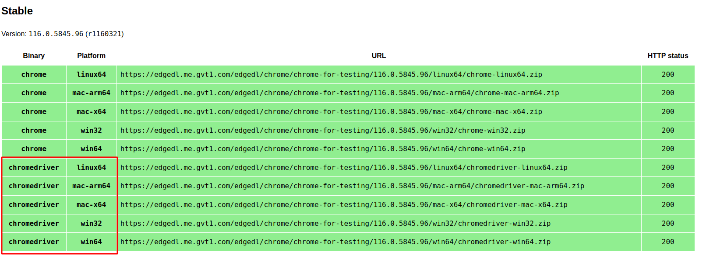
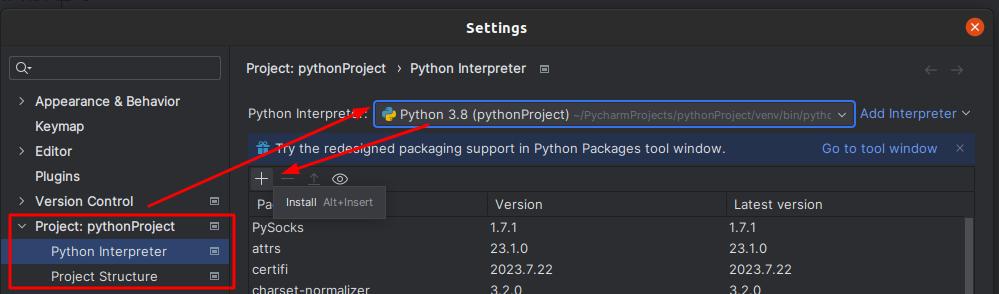
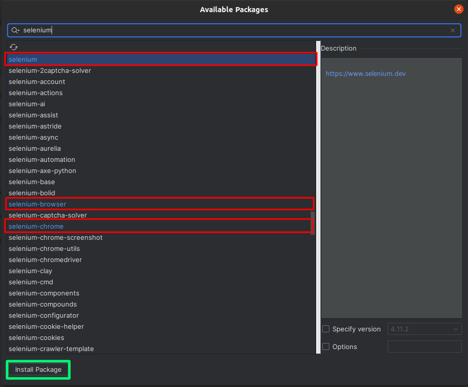
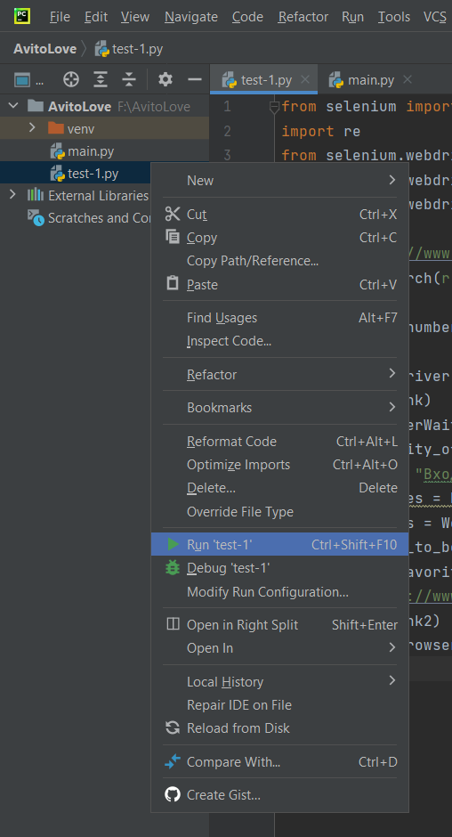

#### Для начала работы и запусков автотестов требуется установить все необходимое программное обеспечение:

1) Google Chrome browser
2) Python
3) PyCharm IDE
4) Google Chrome driver
5) Selenium

### 1.	Установка Google Chrome browser
Скачать браузер актуальной версии можно здесь: https://www.google.com/intl/ru_ru/chrome/
### 2.	Установка Python
Cкачать можно здесь: https://www.python.org/downloads/
Перейти в раздел загрузок  выбрать актуальную версию для скачивания, а затем платформу для которой будем скачивать 

Подробная инструкция по установке, можно ознакомиться здесь: https://tutorial.djangogirls.org/ru/python_installation/

### 3.	Установка PyCharm IDE
Скачать можно здесь: https://www.jetbrains.com/ru-ru/pycharm/download
Подробная инструкция по установке, можно ознакомиться здесь: https://pythonru.com/baza-znanij/poshagovaja-ustanovka-pycharm
### 4.	Установка Google Chrome driver
1. Перейти на сайт https://googlechromelabs.github.io/chrome-for-testing/
2. Выбрать файл для какой ОС будет использоваться, для актуальной версии на текущий момент скачивания - версия 116.0.5845….

3. Скопировать путь и ввести в поисковую строку
4. Создать папку ChromeDriver
5. Извлечь архив в созданную папку
6. Изменить пtременную среды Path, значение переменной указать путь созданной папки
Подробнее об этом можно почитать здесь
https://www.java.com/ru/download/help/path.html

### 5.	Установка библиотек Selenium

1.	Открыть, установленное ранее, приложение PyCharm
2.	В хедер – меню выбрать File → Settings, либо нажать на Ctrl + Alt + S
3.	В открывшемся окне выбрать Python Interpreter, в выпадающем меню выбрать Python и нажать на +

4.	В открывшемся окне Установить библиотеки выделенные на скриншоте, выбирая и нажимая Install Package, после установки нажать ОК

### 6.	Запуск автотестов

1)	В хеддер меню выбрать File → Open и выбрать папку с заранее скачанным автотестом

2)	Выбрать файл test -1 кликнув правой кнопкой мыши и выбрав в меню Run «Test — 1» или нажать  Ctrl + Shift + F10

